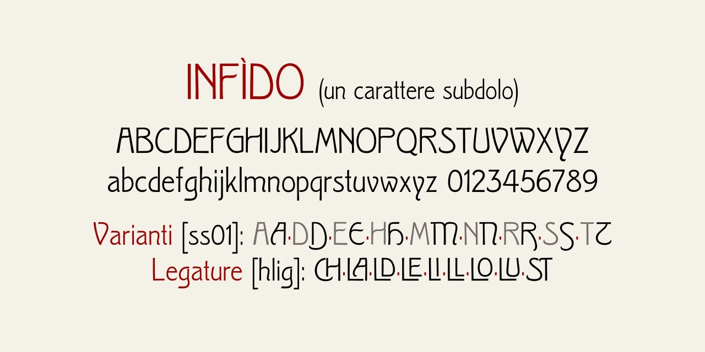

# Infìdo
Versione 1.0: versione iniziale.

## Descrizione
Il font **Infido** è basato su scansioni del carattere [*Clio* o *Kleopatra*](https://fontsinuse.com/typefaces/89092/clio) disegnato da Wagner & Schmidt (1903 circa);
vennero realizzati anche grassetto e corsivo, non considerati per questo font.

Il font permette di ottenere alcune variazioni:
- **ss01**: versioni alternative delle maiuscole ADEHMNRST
- **hlig**: legature per maiuscole CH LA LD LE LI LL LO LU ST

Come [specificato da Treccani](https://www.treccani.it/enciclopedia/infido-o-infido_(La-grammatica-italiana)/), la pronuncia corretta è *infìdo* e non *ìnfido*;
è possibile che la versione corretta *infìdo* suoni errata ad alcuni per assonanza con *stupìdo* dei film con Stanlio e Ollio.

