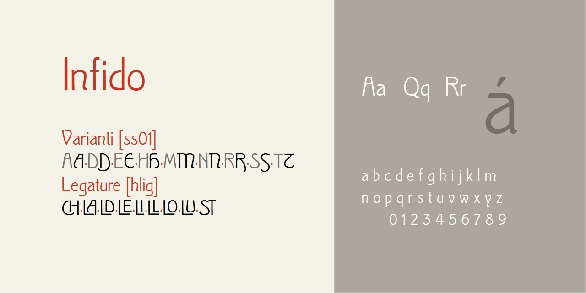

# Infido
- Versione 1.101: fix esportazione
- Versione 1.0: versione iniziale

Per testare il font, vedere la [pagina interattiva](https://m-casanova.github.io/Infido/).

## Descrizione

Il font **Infido** è basato su scansioni del carattere [*Clio* o *Kleopatra*](https://fontsinuse.com/typefaces/89092/clio) disegnato da Wagner & Schmidt (1903 circa) e in Italia indicato come [*Fidia*](https://books.google.it/books?id=QBDdVK3ifTMC&pg=RA2-PA149) (Nebiolo); vennero realizzati anche grassetto e corsivo, non considerati per questo font.

È possibile attivare alcune caratteristiche opzionali del font:
- **ss01** (Stylistic Set 01): versioni alternative delle maiuscole ADEHMNRST
- **hlig** (Historical Ligatures): legature per maiuscole CH LA LD LE LI LL LO LU ST

Come [specificato da Treccani](https://www.treccani.it/enciclopedia/infido-o-infido_(La-grammatica-italiana)/), la pronuncia corretta è *infìdo* (e non *ìnfido*);
è possibile che la versione corretta *infìdo* suoni errata ad alcuni per assonanza con *stupìdo* utilizzato nel doppiaggio dei film con Stanlio e Ollio.
